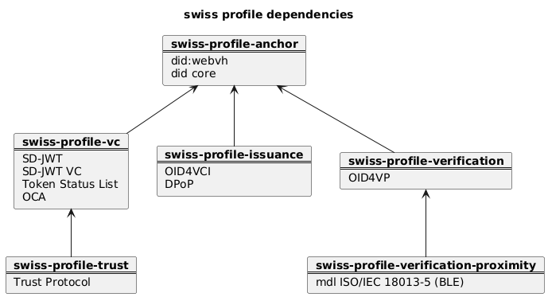

Swiss Profiles provide a stable abstraction layer for managing versioning across our ecosystem of interdependent, versioned artefacts. Instead of dealing with each specification and its versions individually, a Swiss Profile groups them into a coherent, well-defined bundle.

Each Swiss Profile contains:

- A curated set of specifications relevant for a particular domain or integration scenario
- For every specification, one or more allowed versions
- Implementation notes and identified gaps where behaviour deviates from the underlying specs

This structure lets us define what a client or service must support in a single place, while absorbing the complexity of evolving specifications underneath. Swiss Profiles make compatibility expectations explicit, reduce integration friction, and ensure we can evolve the ecosystem without breaking dependent systems.

# Overview

As of now there are 7 Swiss Profiles with the following specifications contained in them.

| Swiss Profile | Specifications |
| swiss-profile-trust | Trust Protocol |
|                     | Non-compliance Protocol |
| swiss-profile-anchor | DID Core |
|                      | DID:webvh |
| swiss-profile-vc | Token Status List |
|                  | SD-JWT |
|                  | SD-JWT-VC |
|                  | OCA |
| swiss-profile-issuance | OAuth 2.0 DPoP |
|                        | OpenID4VCI |
| swiss-profile-verification | OpenID4VP |
|                            | JAR |
| swiss-profile-proximity | mDL ISO-18013-5 BLE |
| swiss-profile-portability | Wallet Backup Container |

# Dependencies between Swiss Profiles

While there exist no hard dependencies between Swiss Profiles (i.e. a spec from Swiss Profile X works on it's own and doesn't strictly need other specifications in Swiss Profile Y) there is still a de facto hierarchy of the Swiss Profiles: some Swiss Profiles build upon another, thus artefacts / use cases sometimes have to depend on multiple Swiss Profiles. 

_Example:
The swiss-profile-verification-proximity is aimed specifically at an artefact concerned with proximity verification, i.e. verification using direct connection via Bluetooth Low Energy.
It builds upon the regular swiss-profile-verification, which covers the more generic verification use case._

The following diagram shows how the Swiss Profiles build upon each other:

