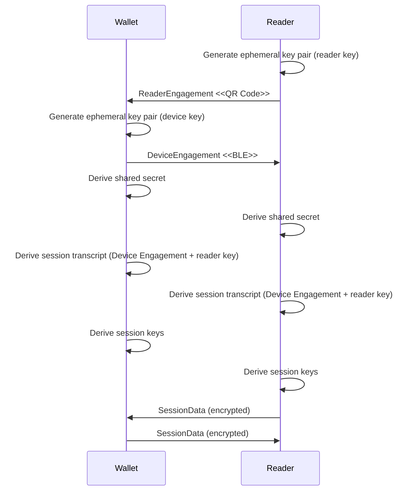
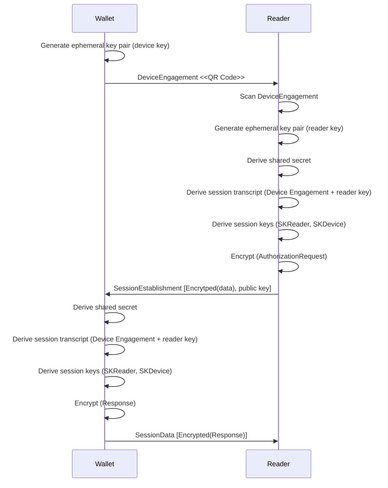

<div class="notice--info">
  Version 1.0 <br>
  Status: draft <br>
  Last edited: 2026-08-04
</div>


# Introduction

This profile specifies the protocol and algorithms used, to enable peer-to-peer proximity verification. It is based on ISO-18013-5 for the engagement and transport protocol part, enhanced with support for DC-API on top of it.

## Terms

- **Reader**: The reader reads credentials stored on a device and checks the verifiable presentation. Reader and "CheckApp" refer to the same instance.
- **Device**: The device presents a credential as a verifiable presentation. Wallet and device refer to the same instance.
- **KDF**: Key derivation function. Used to expand the secret obtained through a DH key exchange.
- **HKDF**: Hmac based key derivation function
- **ECDH**: Elliptic Curve Diffie-Helmann used to agree on a secret between two parties.


## Cryptography
- A reader **MUST** support ECDH-ES using Curve-25519 and P-256 for the Diffie-Hellman key exchange, and **MUST** support AES-256-GCM for symmetric encryption. 
- A device **MUST** support ECDH-ES using Curve-25519 for the Diffie-Hellman key exchange, and **MUST** support AES-256-GCM for symmetric encryption.
- The reader and the device **MUST* follow the ISO-18013-5 specification in establishing an encrypted channel. The following sections restate the process for convenience.

## Specifications

This section details the implementation notes and gaps pertaining to the supported specifications. The device MUST follow the "DC-API over ISO-18013-5" specification in the case of proximity verification cases.

| Contained Specifications | Version | Link to referenced Specification |
| ---- | ---- | ---- |
| ISO/IEC 18013-5:2021 | N/A | [https://www.iso.org/standard/69084.html](https://www.iso.org/standard/69084.html) |
| ISO 23220-4:2026 | N/A | [https://www.iso.org/standard/86785.html)](https://www.iso.org/standard/86785.html) |
| Digital Credentials API | N/A | [https://www.w3.org/TR/digital-credentials/)](https://www.w3.org/TR/digital-credentials/) |

**KEY WORDS** for this swiss profile expand on RFC 2119 "Key words for use in RFCs to Indicate Requirement Levels". They are explained in the [general introduction for the specifications](/specifications/introduction/#key-words). They are to be interpreted as such when, and only when, they appear **bold** and CAPITALIZED.

# DC-API over ISO-18013-5 Specification

This specification combines DC-API and ISO-18013-5 to allow SD-JWT requests over the ISO-18013-5 transport protocol. It contains **parts** of the ISO-18013-5, ISO 23220-4 and OpenID4VP specifications. Everything not explicitly mentioned in this specification **MUST NOT** be used.

## ISO-18013-5/ISO 23220

### Encryption

Device and Reader **MUST** use Curve-25519 for the ECDH. 

For Symmetric encryption AES-256-GCM **MUST** be used.

### Engagement

_DeviceEngagement_ and _ReaderEngagement_ with _BLE transport_ options **MUST** be used.

The _DeviceKey_ and _ReaderKey_ **MUST** be a valid Curve-25519 public key.

The _DeviceEngagement_ and _ReaderEngagement_ **MUST** signal use of DC-API within the capabilities section.

### DC-API Capability

The following capability is added to signal the use of DC-API over ISO-18013-5. The Reader and the Device **MUST** add DcApiSupport to the respective engagement. The DCProtocol **MUST** be "openid4vp-v1-signed".

```
  Capabilities = {
    ? .=> DcApiSupport ; "DCv1"
    * int => any
  }
  DcApiSupport = [ DcProtocol ] ; List of W3C DC API protocols supported by the wallet.
  DcProtocol = tstr ; e.g. "openid4vp", "openid4vp-v1-signed", "openid4vp-v1-unsigned"
```
Reader and Device MUST support "dcApiSelected" in SessionEstablishment and SessionData.

To signal the use of the DC-API within the ISO-18013-5 protocol the Session-Establishment and Session-Data structures MUST set "dcApiSelected" to true.

```
? "dcApiSelected" : boolean ; If available and true, data contains dcApi request
```
## "Reverse Engagement"

The Device and the Reader **MUST** support ReaderEngagement defined in ISO 22320-2.

Ed25519 **MUST** be used. The Device **MUST** send the unencrypted DeviceEngagement with the TransportOptions removed after the channel has been established.

The Reader **MUST** use SessionData and **MUST NOT** send a SessionEstablishment.

### CheckApp - Runtime View

The purpose of the engagement phase is to:
- exchange **ephemeral public keys**
- agree on **transport parameters**
- derive **shared session keys**
- establish a **secure encrypted session**

The two supported engagement variants differ in which party initiates the interaction.

## Reader Engagement (Reverse "ISO-mDL-Flow")

In the **Reader Engagement flow*, the **Reader** (CheckApp) initiates the interaction.

The reader publishes a **ReaderEngagement** structure via QR code.
The wallet reads this structure, generates its own ephemeral key pair, and responds with a **DeviceEngagement**.
Afterwards both parties derive session keys and start encrypted communication.

In the Swiss Profile Proximity, the **reverse QR engagement** slightly modifies the ISO-18013-5 flow.
 



## Device Engagement

In the **Device Engagement flow**, the interaction is initiated by the **Wallet** (Device).

The wallet publishes a QR code containing the **DeviceEngagement** information.

The reader reads the structure, generates its own ephemeral key pair and initiates the communication with a **SessionEstablishement** package. After the key agreement and key derivation steps, the encrypted communication channel is established.



## Digital Credentials API (and OpenID4VP)

The session transcript **MUST** be the following structure:

```
  SessionTranscript = [
    DeviceEngagementBytes,
    EReaderKeyBytes,
    null
  ]

  DeviceEngagementBytes = #6.24(bstr .cbor DeviceEngagement)

  EReaderKeyBytes = #6.24(bstr .cbor EReaderKeyBytes)

```

The origin **MUST** use "iso-18013-5" as an URL scheme. The origin **MUST** be the sha256 encoded session transcript. 

```
iso-18013-5://<sha256-of-encoded-session-transcript>

```
The device **SHOULD** make sure that this origin is contained in the request. The device **MUST** follow all steps described in [https://openid.net/specs/openid-4-verifiable-presentations-1_0.html#appendix-A](https://openid.net/specs/openid-4-verifiable-presentations-1_0.html#appendix-A) i.e. the device and the reader **SHALL** verify the origin.

If the device encounters an origin not contained in expected_origins it **MUST** abbort. 

If the reader encounters an audience in the key-binding JWT of the presentation which does not match the current origin it **MUST** reject the presentation.

## Trust

The device **MUST** ensure that the reader device is trusted. The device **MUST** ensure that openid4vp-v1-signed is being used in the DC-API request. The device **MUST** support verifier_attestation JWTs and **SHOULD** support decentralized_identifier to verify the signature of the presentation.

**Verifier Attestation JWT**: The client ID prefix **MUST** be verifier_attestation. The device **MUST** check if the presentation contains a jwt header field and **MUST** reject the presentation otherwise. If the header contains jwt the device **MUST** ignore kid, and **SHOULD** reject the presentation if it contains a kid. The device **MUST** ensure that the JWT in the jwt header is valid according to [Swiss Profile Anchor](https://swiyu-admin-ch.github.io/specifications/swiss-profile-anchor/). The wallet ***MUST** ensure that the jwt conforms to [OpenID for Verifiable Presentations 1.0](https://openid.net/specs/openid-4-verifiable-presentations-1_0.html#name-verifier-attestation-jwt). 

**Decentralized Identifier**: The client ID prefix **MUST** be decentralized_identifier. The device **MUST** verify the trust according to [Swiss Profile Trust](https://swiyu-admin-ch.github.io/specifications/swiss-profile-trust/).
